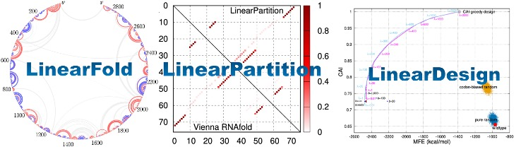

English | [简体中文](README_cn.md)

------

PaddleHelix is a machine-learning-based bio-computing framework aiming at facilitating the development of the following areas:
> * Vaccine design
> * Drug discovery
> * Precision medicine

## Installation

## Documentation
### Tutorials
* We provide abundant [tutorials](./tutorials) to navigate the directory and start quickly.
* PaddleHelix is based on [PaddlePaddle](https://github.com/paddlepaddle/paddle), a high-performance Parallelized Deep Learning Platform.

### Features
* Large-scale Representation Learning and Transfer Learning enhanced bio-computing: Self-supervised learning for molecule representations offers prospects of a breakthrough in tasks with limited annotation, including drug profiling, drug-target interaction, protein-protein interaction, RNA-RNA interaction, protein folding, RNA folding, and molecule design. PaddleHelix implements a variety of representation learning algorithms and state-of-the-art large-scale pre-trained models to help developers to start from "the shoulders of giants" quickly.

  
* LinearRNA: Highly efficient tool-kit for mRNA vaccine development. LinearFold & LinearParitition achieves O(n) complexity in RNA-folding prediction, which is hundreds of times faster than traditional folding techniques.

  
* Easy-to-use APIs: PaddleHelix provide frequently used structures and pre-trained models. You can easily use those components to build up your models and systems.

## Examples
* [Representation Learning - Compound Molecules](./apps/pretrained_compound)
* [Representation Learning - Proteins](./apps/pretrained_protein)
* [Drug-Target Interaction](./apps/drug_target_interaction)
