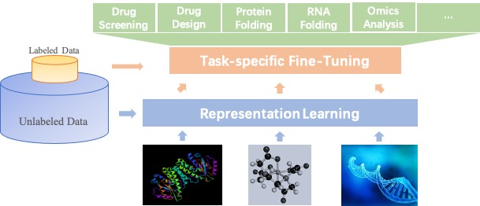

English | [简体中文](README_ch.md)

 
------

PaddleHelix is a machine-learning-based bio-computing framework, features **representation learning** and **multi-task learning**, aiming at facilitating the development of the following areas:
> * Vaccine design
> * Drug discovery
> * Precision medicine

 

## Installation

## Documentation
### Tutorials
* We provide abundant [Tutorials](./docs/tutorials) to navigate the directory and start quickly.
* PaddleHelix is based on [PaddlePaddle](https://github.com/paddlepaddle/paddle), a high-performance Parallelized Deep Learning Platform.

### Features
* Large-scale **Representation Learning** and **Transfer Learning** enhanced bio-computing: Self-supervised learning for molecule representations offers prospects of breakthrough in tasks with limited annotation, including drug profiling, drug target interaction, protein folding, RNA folding, and molecule design. PaddleHelix implements variety of representation learning algorithms, and state-of-the-art large-scale pre-trained models to help developers to quickly start from the shoulders of giants.

* Easy-to-use APIs: PaddleHelix provide frequently used structures and models to help easily build your own model.

## Examples
* [Representation Learning - Compound Molecules](./apps/)
* [Representation Learning - Proteins](./apps/)
* [Drug-Target Interaction](./apps)
* [Tookit - mRNA Vaccine Design](./apps)
