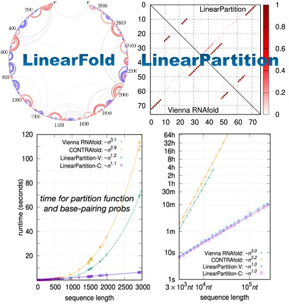

English | [简体中文](README_cn.md)

<p align="center">


------
[](https://github.com/PaddlePaddle/PaddleHelix/releases)


PaddleHelix is a machine-learning-based bio-computing framework aiming at facilitating the development of the following areas:
> * Vaccine design
> * Drug discovery
> * Precision medicine

## Installation

### OS support

Windows, Linux and OSX

### Python version

Python 3.5, 3.6, 3.7

### Dependencies

('-' means that paddlehelix doesn't have a special version requirement for that package)

| name         | version |
| ------------ | ---- |
| numpy        | - |
| pandas       | - |
| networkx     | - |
| paddlepaddle | \>=2.0.0rc0 |
| pgl          | \>=1.2.0 |
| rdkit        | - |
|sklearn|-|

### Insturction
Since our package requires a paddlepaddle version of 2.0.0rc0 or above and the rdkit dependency cannot install directly installed using `pip` command, we suggest you use `conda` to create a new environment for our project. Detailed instructions are shown below:

* If you haven't used conda before, you can check this website to install it:https://docs.conda.io/projects/conda/en/latest/user-guide/install/

* After installing conda, you can create a new conda envoronment:

```bash
conda create -n paddlehelix python=3.7  
```

* To activate the environment, you can use this command:
```bash
conda activate paddlehelix
```

* Before installing the paddlhelix package, you should install the rdkit package using conda command:
```bash
conda install -c conda-forge rdkit
```
* Then you can install the paddlehelix package using the pip command:
```bash
pip install paddlehelix
```
* After installing the paddlehelix, you can run the code now.
* If you want to deactivate the conda environment, you can use this command:

```bash
conda deactivate
```

## Documentation

### Tutorials
* We provide abundant [tutorials](./tutorials) to navigate the directory and start quickly.
* PaddleHelix is based on [PaddlePaddle](https://github.com/paddlepaddle/paddle), a high-performance Parallelized Deep Learning Platform.

### Features
* Highly Efficent: We provide LinearRNA - highly efficient toolkit for mRNA vaccine development. LinearFold & LinearParitition achieves O(n) complexity in RNA-folding prediction, which is hundreds of times faster than traditional folding techniques.
<p align="center">


* Large-scale Representation Learning and Transfer Learning: Self-supervised learning for molecule representations offers prospects of a breakthrough in tasks with limited annotation, including drug profiling, drug-target interaction, protein-protein interaction, RNA-RNA interaction, protein folding, RNA folding, and molecule design. PaddleHelix implements a variety of representation learning algorithms and state-of-the-art large-scale pre-trained models to help developers to start from "the shoulders of giants" quickly.
<p align="center">


* Easy-to-use APIs: PaddleHelix provide frequently used structures and pre-trained models. You can easily use those components to build up your models and systems.

## Examples
* [Representation Learning - Compound Molecules](./apps/pretrained_compound)
* [Representation Learning - Proteins](./apps/pretrained_protein)
* [Drug-Target Interaction](./apps/drug_target_interaction)
