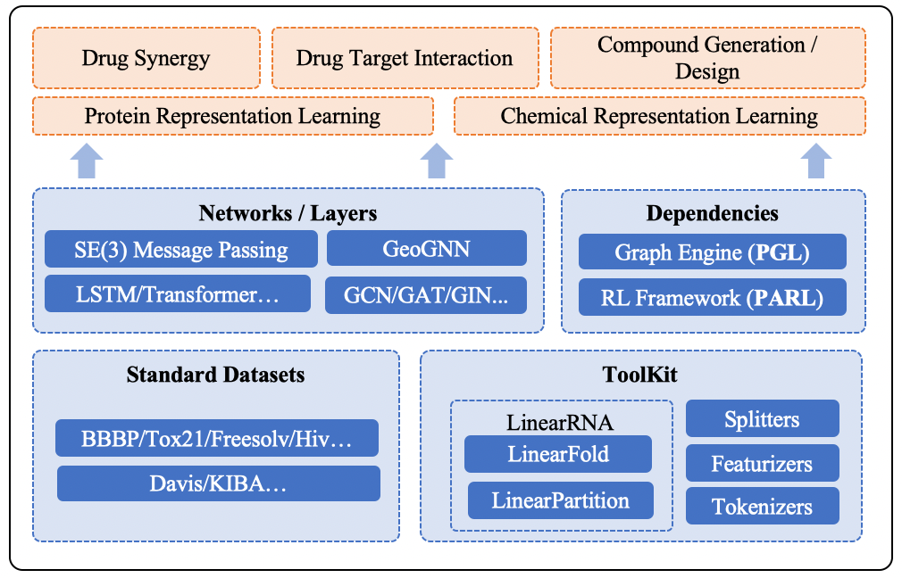

English | [简体中文](README_cn.md)

------

## Latest News
`2022.05.24` Paper "HelixADMET: a robust and endpoint extensible ADMET system incorporating self-supervised knowledge transfer" is published in **Bioinformatics**. Refer to [paper](https://academic.oup.com/bioinformatics/advance-article-abstract/doi/10.1093/bioinformatics/btac342/6590643) for more information.

`2022.02.07` Paper "Geometry-enhanced molecular representation learning for property prediction" is published in **Nature Machine Intelligence**. Please refer to [paper](https://www.nature.com/articles/s42256-021-00438-4) and [codes](./apps/pretrained_compound/ChemRL/GEM) to explore the algorithm.

`2022.01.07` PaddleHelix released the reproduction of [AlphaFold 2](https://doi.org/10.1038/s41586-021-03819-2) using PaddlePaddle in [PaddleFold](./apps/paddlefold).

`2021.11.23` Paper "Multimodal Pre-Training Model for Sequence-based Prediction of Protein-Protein Interaction" is accepted by [MLCB 2021](https://sites.google.com/cs.washington.edu/mlcb2021/home). Please refer to [paper](https://arxiv.org/abs/2112.04814) and [code](https://github.com/PaddlePaddle/PaddleHelix/tree/dev/apps/protein_protein_interaction) for more details.

`2021.10.25` Paper "Docking-based Virtual Screening with Multi-Task Learning" is accepted by [BIBM 2021](https://ieeebibm.org/BIBM2021/).

`2021.09.29` Paper "Property-Aware Relation Networks for Few-shot Molecular Property Prediction" is accepted by [NeurIPS 2021](https://papers.nips.cc/paper/2021/hash/91bc333f6967019ac47b49ca0f2fa757-Abstract.html) as a Spotlight Paper. Please refer to [PAR](./apps/fewshot_molecular_property) for more details.

`2021.07.29` PaddleHelix released a novel geometry-level molecular pre-training model, taking advantage of the 3D spatial structures of the molecules. Please refer to [GEM](./apps/pretrained_compound/ChemRL/GEM) for more details.

`2021.06.17` PaddleHelix team won the 2nd place in the [OGB-LCS KDD Cup 2021 PCQM4M-LSC track](https://ogb.stanford.edu/kddcup2021/results/), predicting DFT-calculated HOMO-LUMO energy gap of molecules. Please refer to [the solution](./competition/kddcup2021-PCQM4M-LSC) for more details.

`2021.05.20` PaddleHelix v1.0 released. 1) Update from static framework to dynamic framework; 2) Add new applications: molecular generation and drug-drug synergy.

`2021.05.18` Paper "Structure-aware Interactive Graph Neural Networks for the Prediction of Protein-Ligand Binding Affinity" is accepted by [KDD 2021](https://kdd.org/kdd2021/accepted-papers/index). The code is available at [here](./apps/drug_target_interaction/sign).

`2021.03.15` PaddleHelix team ranks 1st in the ogbg-molhiv and ogbg-molpcba of [OGB](https://ogb.stanford.edu/docs/leader_graphprop/), predicting the molecular properties.

------

## Introduction
PaddleHelix is a bio-computing tool, taking advantage of the machine learning approaches, especially deep neural networks, for facilitating the development of the following areas:
* **Drug Discovery**. Provide 1) Large-scale pre-training models: compounds and proteins; 2) Various applications: molecular property prediction, drug-target affinity prediction, and molecular generation.
* **Vaccine Design**. Provide RNA design algorithms, including LinearFold and LinearPartition.
* **Precision Medicine**. Provide application of drug-drug synergy.

## Resources
### Application Platform
[PaddleHelix platform](https://paddlehelix.baidu.com/) provides the AI + biochemistry abilities for the scenarios of drug discovery, vaccine design and precision medicine.

### Installation Guide
PaddleHelix is a bio-computing repository based on [PaddlePaddle](https://github.com/paddlepaddle/paddle), a high-performance Parallelized Deep Learning Platform. The installation prerequisites and guide can be found [here](./installation_guide.md).

### Tutorials
We provide abundant [tutorials](./tutorials) to help you navigate the repository and start quickly.
* **Drug Discovery**
  - [Compound Representation Learning and Property Prediction](./tutorials/compound_property_prediction_tutorial.ipynb)
  - [Protein Representation Learning and Property Prediction](./tutorials/protein_pretrain_and_property_prediction_tutorial.ipynb)
  - [Predicting Drug-Target Interaction: GraphDTA](./tutorials/drug_target_interaction_graphdta_tutorial.ipynb), [MolTrans](./tutorials/drug_target_interaction_moltrans_tutorial.ipynb)
  - [Molecular Generation](./tutorials/molecular_generation_tutorial.ipynb)
* **Vaccine Design**
  - [Predicting RNA Secondary Structure](./tutorials/linearrna_tutorial.ipynb)

### Examples
We also provide [examples](./apps) that implement various algorithms and show the methods running the algorithms:
* **Pretraining**
  - [Representation Learning - Compounds](./apps/pretrained_compound)
  - [Representation Learning - Proteins](./apps/pretrained_protein)
* **Drug Discovery and Precision Medicine**
  - [Drug-Target Interaction](./apps/drug_target_interaction)
  - [Molecular Generation](./apps/molecular_generation)
  - [Drug Drug Synergy](./apps/drug_drug_synergy)
  - [Few-shot Molecular Property Prediction](./apps/fewshot_molecular_property)
* **Vaccine Design**
  - [LinearRNA](./c/pahelix/toolkit/linear_rna)
* **Protein Structure Prediction**
  - [PaddleFold](./apps/paddlefold)

### Competition Solutions
PaddleHelix team participated in multiple competitions related to bio-computing. The solutions can be found [here](./competition).

### Guide for Developers
* To develope new functions based on the source code of PaddleHelix, please refer to [guide for developers](./developer_guide.md).
* For more details of the APIs, please refer to the [documents](https://paddlehelix.readthedocs.io/en/dev/).

------

## Welcome to Join Us
We are looking for machine learning researchers / engineers or bioinformatics / computational chemistry researchers interested in AI-driven drug design.
We base in Shenzhen or Shanghai, China.
Please send the resumes to wangfan04@baidu.com or fangxiaomin01@baidu.com.
