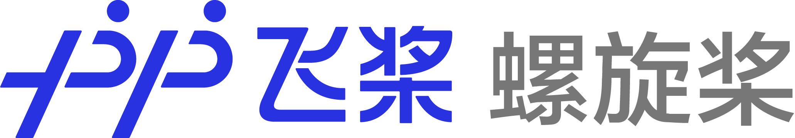
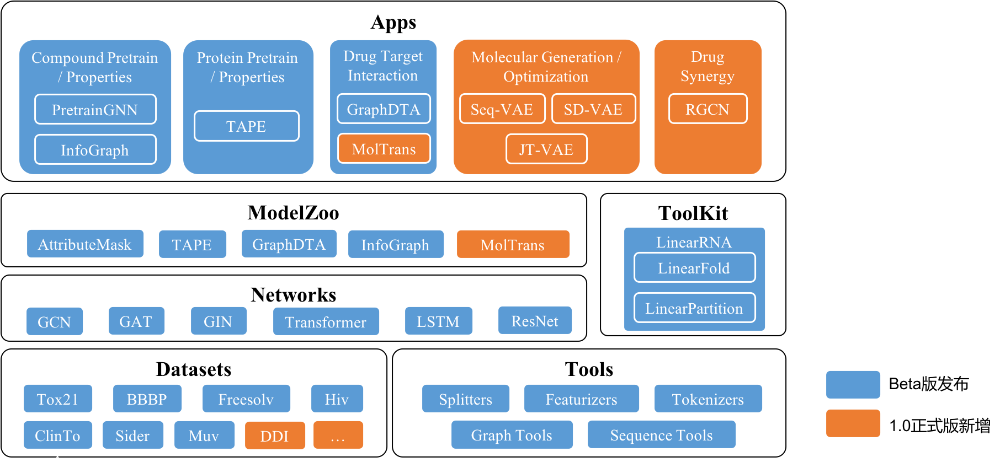

[English](README.md) | 简体中文

------

## 最新消息
`2021.06.17` 螺旋桨团队在[OGB-LCS KDD Cup 2021 PCQM4M-LSC track](https://ogb.stanford.edu/kddcup2021/results/)比赛中赢得了亚军。该项比赛预测使用DFT计算的分子HOMO-LUMO的能量差。请参阅[解决方案](./competition/kddcup2021-PCQM4M-LSC)获得更多的细节。.

`2021.05.20` 螺旋桨v1.0正式版发布。 1)将模型全面从静态图升级到动态图; 2) 添加更多应用: 分子生成和药物联用.

`2021.05.18` 论文"Structure-aware Interactive Graph Neural Networks for the Prediction of Protein-Ligand Binding Affinity"被[KDD 2021](https://kdd.org/kdd2021/accepted-papers/index)接收。代码参见[这里](./apps/drug_target_interaction/sign).

`2021.03.15` 螺旋桨团队在权威图榜单[OGB](https://ogb.stanford.edu/docs/leader_graphprop/)的ogbg-molhiv和ogbg-molpcba任务上取得第一名。这两项任务均是预测小分子的属性。

---

## 简介
螺旋桨（PaddleHelix）是一个生物计算工具集，是用机器学习的方法，特别是深度神经网络，致力于促进以下领域的发展：

* **新药发现**。提供1)大规模预训练模型:化合物和蛋白质; 2)多种应用:分子属性预测,药物靶点亲和力预测,和分子生成。
* **疫苗设计**。提供RNA设计算法,包括LinearFold和LinearPartition。
* **精准医疗**。提供药物联用的应用。

---
## 项目资源
### 计算平台
[PaddleHelix平台](https://paddlehelix.baidu.com/)提供AI+生物计算能力，满足新药研发、疫苗设计、精准医疗场景的AI需求。

### 安装指南
螺旋桨是一个基于高性能机器学习工具[PaddlePaddle飞桨](https://github.com/paddlepaddle/paddle)的生物计算开源工具库。详细的安装和环境配置指引请查阅[这里](./installation_guide_cn.md)。

### 教学示例
我们提供了大量的[教学示例](./tutorials/README_cn.md)以方便开发者快速了解和使用该框架：
* **Drug Discovery**
  - [化合物表示和属性预测](./tutorials/compound_property_prediction_tutorial_cn.ipynb)
  - [蛋白质表示和属性预测](./tutorials/protein_pretrain_and_property_prediction_tutorial_cn.ipynb)
  - [药物-分子作用预测: GraphDTA](./tutorials/drug_target_interaction_graphdta_tutorial_cn.ipynb), [MolTrans](./tutorials/drug_target_interaction_moltrans_tutorial_cn.ipynb)
  - [分子生成](./tutorials/molecular_generation_tutorial_cn.ipynb)
* **Vaccine Design**
  - [RNA结构预测](./tutorials/linearrna_tutorial_cn.ipynb)

### 使用示例
我们也提供了多个算法的[代码和使用示例](./apps/README_cn.md):
* **预训练**
  - [表示学习 - 化合物](./apps/pretrained_compound/README_cn.md)
  - [表示学习 - 蛋白质](./apps/pretrained_protein/README_cn.md)
* **新药发现和精准医疗**
  - [药物-分子作用预测](./apps/drug_target_interaction/README_cn.md)
  - [分子生成](./apps/molecular_generation/README_cn.md)
  - [药物联用](./apps/drug_drug_synergy/README_cn.md)
* **疫苗设计**
  - [LinearRNA](./c/pahelix/toolkit/linear_rna/README_cn.md)

### 比赛解决方案
螺旋桨团队参加了多项生物计算相关的赛事，相关解决方案可以参阅[这里](./competition).

### 开发者指南
* 如果你需要基于螺旋桨的源代码进行新功能的开发，请查阅我们提供的[开发者指南](./developer_guide_cn.md)。
* 如果你想知道螺旋桨各种接口的详情，请查阅[API文档](https://paddlehelix.readthedocs.io/en/dev/)。

------

## 欢迎加入我们
我们正在招聘对人工智能驱动的药物设计感兴趣的机器学习研究人员/工程师或生物信息/计算化学相关研究人员。
我们的工作地点在中国深圳/上海。
请把简历寄到wangfan04@baidu.com 或者fangxiaomin01@baidu.com。
