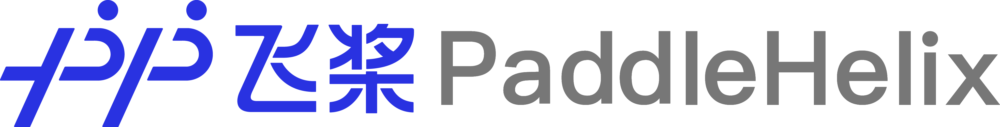
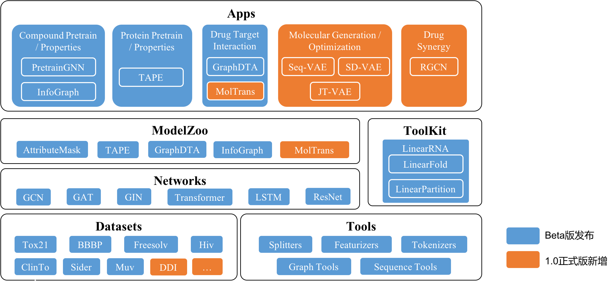

[English](README.md) | [简体中文](README_cn.md) | 日本語

------

## 最新ニュース
`2024.08.30` **素晴らしいニュースをお知らせします！バイオ分子構造予測のためのHelixFold3サーバーの初版がPaddleHelixウェブサイト（https://paddlehelix.baidu.com/app/all/helixfold3/forecast）で利用可能になりました。皆さんがその機能を探索し、影響力のある革新的な研究に活用することを奨励します。**

`2024.08.15` PaddleHelixは、AlphaFold3の能力を再現するバイオ分子構造予測のHelixFold3のコードとモデルパラメータをリリースしました。HelixFold3は、従来のリガンド、核酸、タンパク質の構造予測においてAlphaFold3と同等の精度を達成しています。HelixFold3の初期リリースは、非商用の学術研究のためにGitHubでオープンソースとして提供されており、バイオ分子研究の進展と発見の加速を約束します。詳細については、[コード](./apps/protein_folding/helixfold3)を参照してください。

`2024.05.23` PaddleHelixは、タンパク質-リガンド構造予測の可能性を引き出すために大規模に生成されたドッキング構造に対する事前トレーニングモデルであるHelixDockのコードをリリースしました。これにより、予測精度と一般化能力が大幅に向上します。詳細については、[論文](https://arxiv.org/abs/2310.13913)および[コード](./apps/molecular_docking/helixdock)を参照してください。構造予測のオンラインサービスを試すには、[PaddleHelixウェブサイト](https://paddlehelix.baidu.com/app/drug/helix-dock/forecast)をご覧ください。

`2024.05.13` 論文「Multi-purpose RNA Language Modeling with Motif-aware Pre-training and Type-guided Fine-tuning」がNature Machine Intelligenceに受理されました。詳細については、[論文](https://www.nature.com/articles/s42256-024-00836-4)および[コード](https://github.com/CatIIIIIIII/RNAErnie)を参照してください。

`2024.04.16` PaddleHelixは、抗原-抗体およびペプチド-タンパク質構造予測において顕著な成功を収めたタンパク質複合体構造予測モデルであるHelixFold-Multimerの技術報告書をリリースしました。詳細については、[報告書](https://arxiv.org/abs/2404.10260v2)を参照してください。一般的なタンパク質複合体および抗原-抗体タンパク質複合体のオンライン構造予測サービスは、それぞれ[PaddleHelixプラットフォーム](https://paddlehelix.baidu.com/app/drug/protein-complex/forecast)および[リンク2](https://paddlehelix.baidu.com/app/drug/KYKT/forecast)で利用可能です。

`2023.10.09` HelixFold-Singleの研究「A method for multiple-sequence-alignment-free protein structure prediction using a protein language model」がNature Machine Intelligenceに受理されました。詳細については、[論文](https://doi.org/10.1038/s42256-023-00721-6)を参照してください。

`2022.12.08` 論文「HelixMO: Sample-Efficient Molecular Optimization in Scene-Sensitive Latent Space」が**BIBM 2022**に受理されました。詳細については、[リンク1](https://www.computer.org/csdl/proceedings-article/bibm/2022/09995561/1JC23yWxizC)または[リンク2](https://aps.arxiv.org/abs/2112.00905)を参照してください。薬物設計サービスは、ウェブサイト[PaddleHelix](https://paddlehelix.baidu.com/app/drug/drugdesign/forecast)で利用可能です。

`2022.08.11` PaddleHelixは、長距離多体相互作用をモデル化する新しい分子特性予測ネットワークであるHelixGEM-2のコードをリリースしました。HelixGEM-2は、OGB [PCQM4Mv2](https://ogb.stanford.edu/docs/lsc/leaderboards/)リーダーボードで1位を獲得しました。詳細については、[論文](https://arxiv.org/abs/2208.05863)および[コード](./apps/pretrained_compound/ChemRL/GEM-2)を参照してください。

`2022.07.29` PaddleHelixは、一次配列のみを使用して**MSAフリー**のタンパク質構造予測パイプラインであるHelixFold-Singleのコードをリリースしました。HelixFold-Singleは、**数秒でタンパク質構造を予測**できます。詳細については、[論文](https://arxiv.org/abs/2207.13921)および[コード](./apps/protein_folding/helixfold-single)を参照してください。構造予測のオンラインサービスを試すには、[PaddleHelixウェブサイト](https://paddlehelix.baidu.com/app/drug/protein-single/forecast)をご覧ください。

`2022.07.18` PaddleHelixは、HelixFoldのトレーニングおよび推論パイプラインを完全にリリースしました。**完全なトレーニング時間は11日から5.12日に最適化されました。超長単量体タンパク質（約6600 AA）の予測がサポートされました**。詳細については、[論文](https://arxiv.org/abs/2207.05477)および[コード](./apps/protein_folding/helixfold)を参照してください。

`2022.07.07` 論文「BatchDTA: implicit batch alignment enhances deep learning-based drug–target affinity estimation」が**Briefings in Bioinformatics**に掲載されました。詳細については、[論文](https://academic.oup.com/bib/advance-article-abstract/doi/10.1093/bib/bbac260/6632927)および[コード](./apps/drug_target_interaction/batchdta)を参照してください。

`2022.05.24` 論文「HelixADMET: a robust and endpoint extensible ADMET system incorporating self-supervised knowledge transfer」が**Bioinformatics**に掲載されました。詳細については、[論文](https://academic.oup.com/bioinformatics/advance-article-abstract/doi/10.1093/bioinformatics/btac342/6590643)を参照してください。

`2022.02.07` 論文「Geometry-enhanced molecular representation learning for property prediction」が**Nature Machine Intelligence**に掲載されました。詳細については、[論文](https://www.nature.com/articles/s42256-021-00438-4)および[コード](./apps/pretrained_compound/ChemRL/GEM)を参照してください。

さらにニュース...

`2022.01.07` PaddleHelixは、[AlphaFold 2](https://doi.org/10.1038/s41586-021-03819-2)の推論パイプラインをPaddlePaddleで再現した[HelixFold](./apps/protein_folding/helixfold)をリリースしました。

`2021.11.23` 論文「Multimodal Pre-Training Model for Sequence-based Prediction of Protein-Protein Interaction」が[MLCB 2021](https://sites.google.com/cs.washington.edu/mlcb2021/home)に受理されました。詳細については、[論文](https://arxiv.org/abs/2112.04814)および[コード](https://github.com/PaddlePaddle/PaddleHelix/tree/dev/apps/protein_protein_interaction)を参照してください。

`2021.10.25` 論文「Docking-based Virtual Screening with Multi-Task Learning」が[BIBM 2021](https://ieeebibm.org/BIBM2021/)に受理されました。

`2021.09.29` 論文「Property-Aware Relation Networks for Few-shot Molecular Property Prediction」が[NeurIPS 2021](https://papers.nips.cc/paper/2021/hash/91bc333f6967019ac47b49ca0f2fa757-Abstract.html)にSpotlight Paperとして受理されました。詳細については、[PAR](./apps/fewshot_molecular_property)を参照してください。

`2021.07.29` PaddleHelixは、分子の3D空間構造を活用した新しい幾何レベルの分子事前トレーニングモデルをリリースしました。詳細については、[GEM](./apps/pretrained_compound/ChemRL/GEM)を参照してください。

`2021.06.17` PaddleHelixチームは、分子のDFT計算によるHOMO-LUMOエネルギーギャップを予測する[OGB-LCS KDD Cup 2021 PCQM4M-LSCトラック](https://ogb.stanford.edu/kddcup2021/results/)で2位を獲得しました。詳細については、[ソリューション](./competition/kddcup2021-PCQM4M-LSC)を参照してください。

`2021.05.20` PaddleHelix v1.0がリリースされました。1）静的フレームワークから動的フレームワークへの全面的なアップデート。2）新しいアプリケーションの追加：分子生成と薬物併用。

`2021.05.18` 論文「Structure-aware Interactive Graph Neural Networks for the Prediction of Protein-Ligand Binding Affinity」が[KDD 2021](https://kdd.org/kdd2021/accepted-papers/index)に受理されました。コードは[こちら](./apps/drug_target_interaction/sign)で利用可能です。

`2021.03.15` PaddleHelixチームは、分子特性を予測する[OGB](https://ogb.stanford.edu/docs/leader_graphprop/)のogbg-molhivおよびogbg-molpcbaで1位を獲得しました。

------

## 紹介
PaddleHelixは、機械学習アプローチ、特に深層ニューラルネットワークを活用して、以下の分野の発展を促進するためのバイオコンピューティングツールです。
* **新薬発見**。1）大規模な事前トレーニングモデル：化合物とタンパク質。2）さまざまなアプリケーション：分子特性予測、薬物-ターゲット親和性予測、および分子生成。
* **ワクチン設計**。LinearFoldおよびLinearPartitionを含むRNA設計アルゴリズムを提供します。
* **精密医療**。薬物併用のアプリケーションを提供します。

## リソース
### アプリケーションプラットフォーム
**[PaddleHelixプラットフォーム](https://paddlehelix.baidu.com/)**は、薬物発見、ワクチン設計、精密医療のシナリオに対するAI + 生化学の能力を提供します。

### インストールガイド
PaddleHelixは、高性能な並列化ディープラーニングプラットフォームである[PaddlePaddle](https://github.com/paddlepaddle/paddle)に基づくバイオコンピューティングリポジトリです。インストールの前提条件とガイドは[こちら](./installation_guide.md)で確認できます。

### チュートリアル
リポジトリをナビゲートし、迅速に開始するための豊富な[チュートリアル](./tutorials)を提供しています。
* **新薬発見**
  - [化合物表現学習と特性予測](./tutorials/compound_property_prediction_tutorial.ipynb)
  - [タンパク質表現学習と特性予測](./tutorials/protein_pretrain_and_property_prediction_tutorial.ipynb)
  - [薬物-ターゲット相互作用の予測：GraphDTA](./tutorials/drug_target_interaction_graphdta_tutorial.ipynb)、[MolTrans](./tutorials/drug_target_interaction_moltrans_tutorial.ipynb)
  - [分子生成](./tutorials/molecular_generation_tutorial.ipynb)
* **ワクチン設計**
  - [RNA二次構造の予測](./tutorials/linearrna_tutorial.ipynb)

### 例
さまざまなアルゴリズムを実装し、アルゴリズムを実行する方法を示す[例](./apps)も提供しています。
* **事前トレーニング**
  - [表現学習 - 化合物](./apps/pretrained_compound)
  - [表現学習 - タンパク質](./apps/pretrained_protein)
* **新薬発見と精密医療**
  - [薬物-ターゲット相互作用](./apps/drug_target_interaction)
  - [分子生成](./apps/molecular_generation)
  - [薬物併用](./apps/drug_drug_synergy)
  - [少数ショット分子特性予測](./apps/fewshot_molecular_property)
* **ワクチン設計**
  - [LinearRNA](./c/pahelix/toolkit/linear_rna)
* **タンパク質構造予測**
  - [HelixFold](./apps/protein_folding/helixfold)
  - [HelixFold-Single](./apps/protein_folding/helixfold-single)
  - [HelixFold3](./apps/protein_folding/helixfold3)

### コンペティションソリューション
PaddleHelixチームは、バイオコンピューティングに関連する複数のコンペティションに参加しました。ソリューションは[こちら](./competition)で確認できます。

### 開発者ガイド
* PaddleHelixのソースコードに基づいて新しい機能を開発するには、[開発者ガイド](./developer_guide.md)を参照してください。
* APIの詳細については、[ドキュメント](https://paddlehelix.readthedocs.io/en/dev/)を参照してください。

------

## 著作権とライセンス
Shield: [![CC BY-NC-SA 4.0][cc-by-nc-sa-shield]][cc-by-nc-sa]

この作品は、[クリエイティブ・コモンズ 表示 - 非営利 - 継承 4.0 国際 ライセンス][cc-by-nc-sa]の下にライセンスされています。

[![CC BY-NC-SA 4.0][cc-by-nc-sa-image]][cc-by-nc-sa]

[cc-by-nc-sa]: http://creativecommons.org/licenses/by-nc-sa/4.0/
[cc-by-nc-sa-image]: https://licensebuttons.net/l/by-nc-sa/4.0/88x31.png
[cc-by-nc-sa-shield]: https://img.shields.io/badge/License-CC%20BY--NC--SA%204.0-lightgrey.svg
