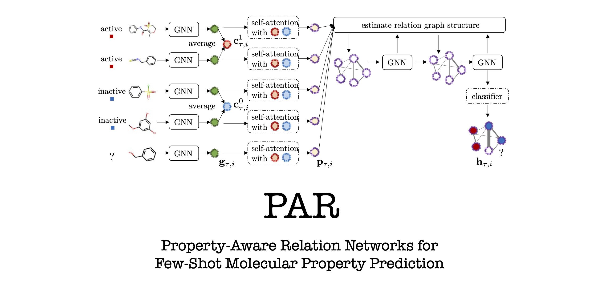

# PAR-NeurIPS21: PaddlePaddle Codes

<p align="center">

This is the PaddlePaddle implementation of ["Property-Aware Relation Networks (PAR) for Few-Shot Molecular Property Prediction"](https://papers.nips.cc/paper/2021/hash/91bc333f6967019ac47b49ca0f2fa757-Abstract.html) published in *NeurIPS 2021* as a *Spotlight* paper. 

Please cite our paper if you find it helpful. Thanks. 
```
@InProceedings{wang2021property,
  title={Property-Aware Relation Networks for Few-Shot Molecular Property Prediction},
  author={Wang, Yaqing and Abuduweili, Abulikemu and Yao, Quanming and Dou, Dejing},
  booktitle = {Advances in Neural Information Processing Systems},
  year={2021},
}
```

## Environment  

We used the following packages for core development. We tested on `paddlepaddle 2.0.2`.

```
- paddlepaddle 2.0.2
- pgl 2.1.5
- paddlehelix 1.0.1
```

## Datasets 

Tox21, SIDER, MUV and ToxCast are previously downloaded from [SNAP](http://snap.stanford.edu/gnn-pretrain/data/chem_dataset.zip). You can download the data [here](https://drive.google.com/file/d/1K3c4iCFHEKUuDVSGBtBYr8EOegvIJulO/view?usp=sharing), unzip the file and put the resultant ``muv, sider, tox21, and toxcast" in the data folder. 

## Experiments

To run the experiments, use the command (please check and tune the hyper-parameters in [parser.py](parser.py)):

```
python main.py
```

If you want to quickly run PAR method on tox21 dataset, please use the command:

```
bash script_train.sh
```


## Contact
We welcome advices and feedbacks for PAR. Please feel free to contact [Yaqing Wang](mailto:wangyaqing01@baidu.com) or [Zhenqian Shen](mailto:shenzhenqian@baidu.com).