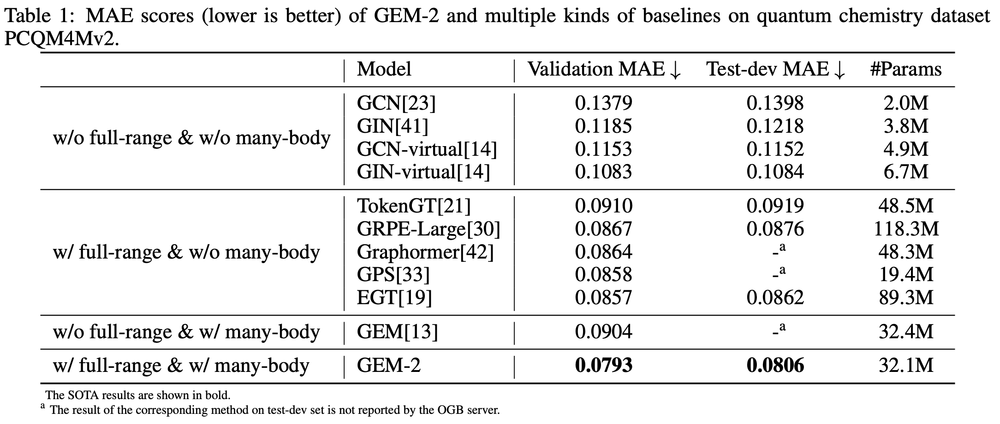
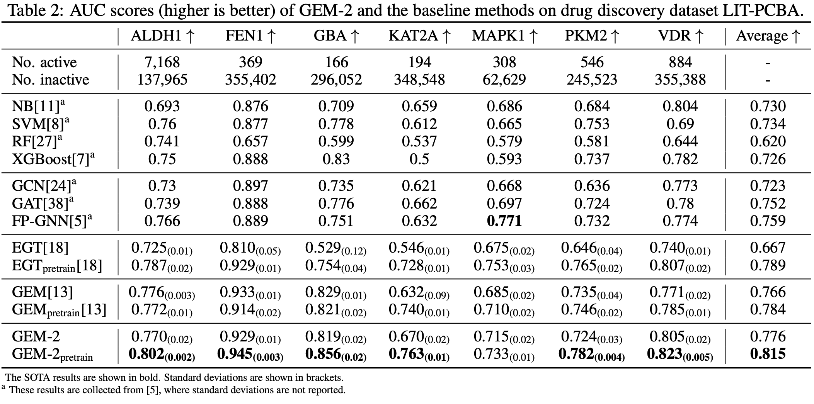

# GEM-2: Next Generation Molecular Property Prediction Network by Modeling Full-range Many-body Interactions
GEM-2 is a molecular modeling framework which comprehensively considers full-range many-body interactions in molecules. Multiple tracks are utilized to model the full-range interactions between the many-bodies with different orders, and a novel axial attention mechanism is designed to approximate the full-range interaction modeling with much lower computational cost.
A preprint version of our work can be found [here](https://arxiv.org/abs/2208.05863).

# Framework
<p align="center">

</p>

The overall framework of GEM-2. First, a molecule is described by the representations of many-bodies of multiple orders. Then, Optimus blocks are designed to update the representations. Each Optimus block contains $M$ tracks, and the $m$-th track contains a stack of many-body axial attentions to model the full-range interactions between the $m$-bodies. The many-body axial attentions and the Low2High module also play the roles of exchanging messages across the tracks. Finally, the molecular property prediction is made by pooling over the $1$-body representations.
# Result
## PCQM4Mv2
PCQM4Mv2 is a large-scale quantum chemistry dataset containing the DFT-calculated HOMO-LUMO
energy gaps. The OGB leaderboard for PCQM4Mv2 can be found [here](https://ogb.stanford.edu/docs/lsc/leaderboards/#pcqm4mv2).
<p align="center">

</p>

## LITPCBA
LIT-PCBA is a virtual screening dataset containing protein targets with their corresponding active and inactive compounds selected from high-confidence PubChem Bioassay data
<p align="center">

</p>

# Installation guide
## Prerequisites

* OS support: Linux
* Python version: 3.6, 3.7, 3.8

## Dependencies

| name         | version |
| ------------ | ---- |
| numpy        | - |
| pandas       | - |
| paddlepaddle | \>=2.0.0 |
| rdkit-pypi   | - |
| sklearn      | - |

# Usage

Firstly, download or clone the lastest github repository:

    git clone https://github.com/PaddlePaddle/PaddleHelix.git
    git checkout dev
    cd apps/pretrained_compound/ChemRL/GEM-2

# Data
You can download the PCQM4Mv2 dataset from ogb website: 
    
    https://dgl-data.s3-accelerate.amazonaws.com/dataset/OGB-LSC/pcqm4m-v2.zip

# Processed Data
You can download the processed PCQM4Mv2 dataset with rdkit generated 3d information from [here](    https://baidu-nlp.bj.bcebos.com/PaddleHelix/datasets/compound_datasets/pcqm4mv2_gem2.tgz).
And then use tar to unzip the data.
```bash
  mkdir -p ../data
  tar xzf pcqm4mv2_gem2.tgz -C ../data
```

# How to run
## Introduction to related configs
You can adjsut the json files in the config folder to  change the training settings.
### dataset_config
- `data_dir`: where the data located
- `task_names`: the name of the label column in the datafile

### model_config
- `model`: model related information, like the channel size, dropout
- `data`: data transform setting


### train_config
- `lr`: learning rate
- `warmup_step`: the step to warm up learning rate to lr
- `mid_step`: steps before learning rate decay

## Start training 

    sh scripts/train.sh

The models will be saved under `./model`.

It will take around 60 mintues to finish one epoch on 16 A100 cards with total batch size of 512.

## Run inference
To reproduce the result from the ogb leaderboard, you can download the checkponit from [here](https://baidu-nlp.bj.bcebos.com/PaddleHelix/models/molecular_modeling/gem2_l12_c256.pdparams).
Then put it under the local `./model` folder and run the inference command:

    sh scripts/inference.sh


## Citing this work

If you use the code or data in this repos, please cite:

```bibtex
@article{liu2022gem-2,
  title={GEM-2: Next Generation Molecular Property Prediction Network with Many-body and Full-range Interaction Modeling
},
  author={Liu, Lihang and He, Donglong and Fang, Xiaomin and Zhang, Shanzhuo and Wang, Fan and He, Jingzhou and Wu, Hua},
  journal={arXiv preprint arXiv:2208.05863},
  year={2022}
}
```
