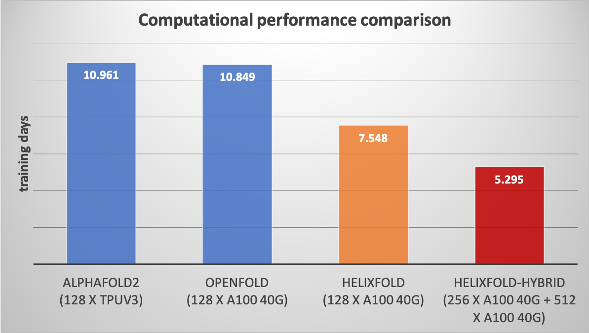
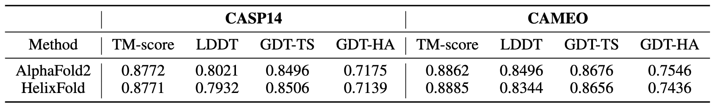

# [HelixFold](https://arxiv.org/abs/2207.05477): An Efficient and Improved Implementation of [AlphaFold 2](https://doi.org/10.1038/s41586-021-03819-2) through [PaddlePaddle](https://github.com/paddlepaddle/paddle)

AlphaFold2 is an accurate protein structure prediction pipeline. [HelixFold](https://arxiv.org/abs/2207.05477) provides an efficient and improved implementation of the complete training and inference pipelines of AlphaFold2 in GPU and DCU. Compared with the computational performance of AlphaFold2 reported in the paper and OpenFold implemented through PyTorch, HelixFold reduces the training time from about 11 days to 7.5 days. Training HelixFold from scratch can achieve competitive accuracy with AlphaFold2.

<p align="left">


</p>

## Instruction
The detailed instructions on running HelixFold in GPU and DCU for training and inference are provided in the following links:
* [Training in GPU](README_train.md)
* [Training in DCU](README_DCU.md)
* [Inference in GPU](README_inference.md)

##  Technical Highlights for Efficient Implementation

* **Branch Parallelism and Hybrid Parallelism** HelixFold proposes **Branch Parallelism (BP)** to split the calculation branch across multiple devices in order to accelerate computation during the initial training phase. The training cost is further reduced by training with **Hybrid Parallelism**, combining BP with Dynamic Axial Parallelism (DAP) and Data Parallelism (DP).

* **Operator Fusion and Tensor Fusion to Reduce the Cost of Scheduling** Scheduling a huge number of operators is one of the bottlenecks for the training. To reduce the cost of scheduling, *Fused Gated Self-Attention* is utilized to combine multiple block into an operator, and thousands of tensors are fused into only a few tensors.

* **Multi-dimensional Memory Optimization** Multiple techniques, including Recompute, BFloat16, In-place memory, and Subbatch (Chunking), are exploited to reduce the memory required for training.

Please refer to [paper](https://arxiv.org/abs/2207.05477) for more technical details.

## Copyright

HelixFold code is licensed under the Apache 2.0 License, which is same as AlphaFold. However, we use the AlphaFold parameters pretrained by DeepMind, which are made available for non-commercial use only under the terms of the CC BY-NC 4.0 license.

## Reference

[1] Jumper J, Evans R, Pritzel A, et al. Highly accurate protein structure prediction with AlphaFold[J]. Nature, 2021, 596(7873): 583-589.

## Citation
```
@article{wang2022helixfold,
  title={HelixFold: An Efficient Implementation of AlphaFold2 using PaddlePaddle},
  author={Wang, Guoxia and Fang, Xiaomin and Wu, Zhihua and Liu, Yiqun and Xue, Yang and Xiang, Yingfei and Yu, Dianhai and Wang, Fan and Ma, Yanjun},
  journal={arXiv preprint arXiv:2207.05477},
  year={2022}
}
```
