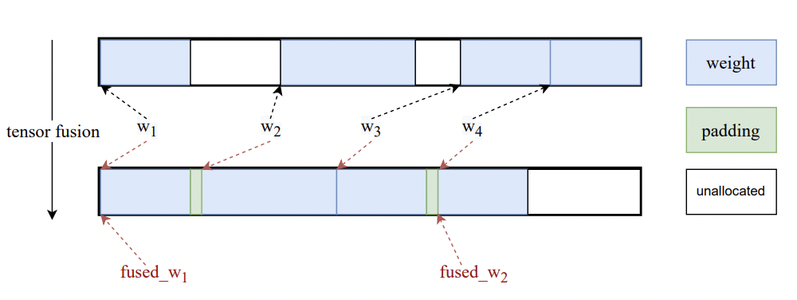

# HelixFold: An Efficient Implementation of [AlphaFold 2](https://doi.org/10.1038/s41586-021-03819-2) through [PaddlePaddle](https://github.com/paddlepaddle/paddle)

[HelixFold](https://arxiv.org/abs/2207.05477) provides an efficient and improved implementation of the complete training and inference pipelines of AlphaFold2 in GPU and DCU. Compared with the computational performance of AlphaFold2 reported in the paper and OpenFold implemented through PyTorch, HelixFold reduces the training time from about 11 days to 7.5 days. Training HelixFold from scratch can achieve competitive accuracy with AlphaFold2.

<p align="center">

</p>

The installation prerequisites are different for the training and inference pipeline in GPU and DCU. The following links provide detailed instructions on running HelixFold.

* [Training Pipeline in GPU](README_train.md)
* [Training Pipeline in DCU](README_DCU.md)
* [Inference Pipeline in GPU](README_inference.md)

## Highlights

### Branch Parallelism and Hybrid Parallelism

HelixFold proposes **Branch Parallelism (BP)** to split the calculation branch across multiple devices in order to accelerate computation during initial training phase. The training cost is further reduced by training with **Hybrid Parallelism** which combines BP with Dynamic Axial Parallelism (DAP) and Data Parallelism (DP).

<p align="center">

</p>

### Fused Gated Self-Attention

Because of the fairly small mini-batch size and sequence length, scheduling a huge number of operators is one of the bottlenecks for training AlphaFold2. HelixFold proposes **Fused Gated Self-Attention** to optimize both the CPU and GPU utilization.

<p align="center">

</p>

### Tensor Fusion

HelixFold fuses 4,630 model parameters of AlphaFold2 into a single one or a few parameters and modify the data pointer to fused memory by **Tensor Fusion**. It significantly improves the training efficiency and reduces memory fragmentation by reducing the number of kernal launches as well as the repeated creation and destruction of temporary small tensors.

<p align="center">

</p>

Please check our [paper](https://arxiv.org/abs/2207.05477) for more details.

## Copyright

HelixFold code is licensed under the Apache 2.0 License, which is same as AlphaFold. However, we use the AlphaFold parameters pretrained by DeepMind, which are made available for non-commercial use only under the terms of the CC BY-NC 4.0 license.

## Reference

[1] Jumper J, Evans R, Pritzel A, et al. Highly accurate protein structure prediction with AlphaFold[J]. Nature, 2021, 596(7873): 583-589.

## Citation

If you find our work is helpful to your research, please cite:

```
@article{wang2022helixfold,
  title={HelixFold: An Efficient Implementation of AlphaFold2 using PaddlePaddle},
  author={Wang, Guoxia and Fang, Xiaomin and Wu, Zhihua and Liu, Yiqun and Xue, Yang and Xiang, Yingfei and Yu, Dianhai and Wang, Fan and Ma, Yanjun},
  journal={arXiv preprint arXiv:2207.05477},
  year={2022}
}
```
