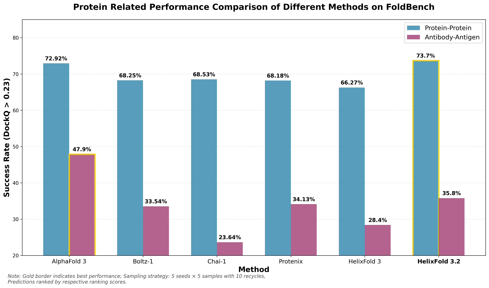
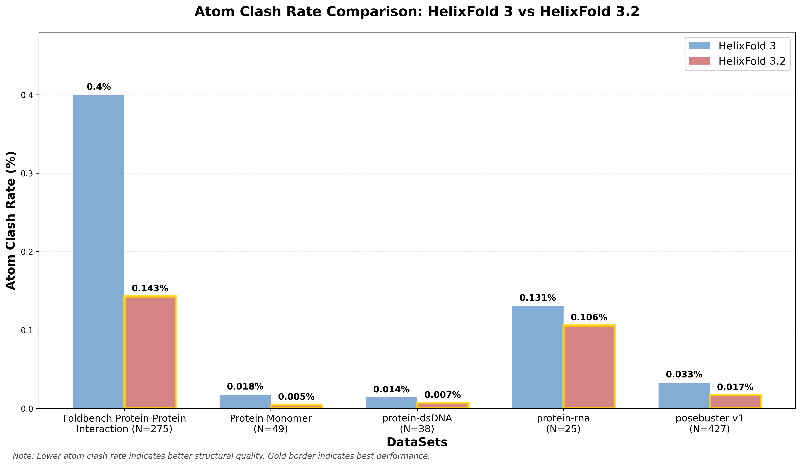
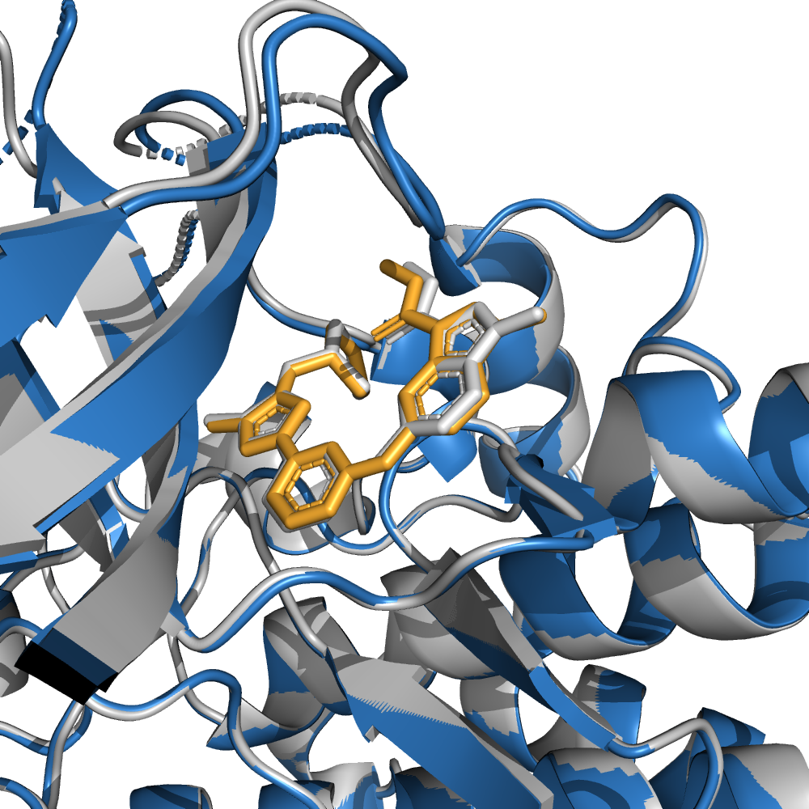
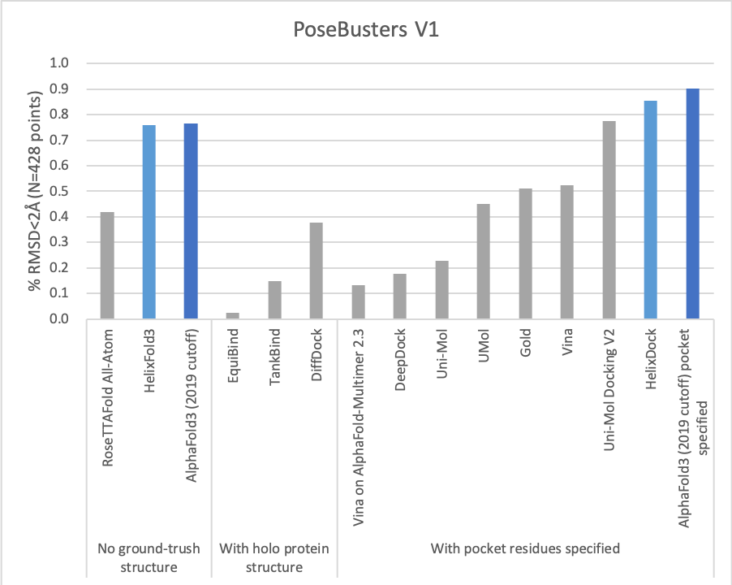
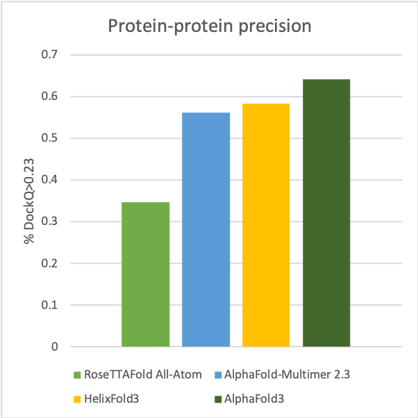
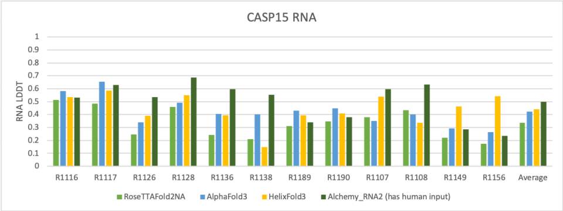

# Biomolecular Structure Prediction with HelixFold3: Replicating the Capabilities of AlphaFold3

## 📣 Updates

- 2025-07-23: **HelixFold3.2** brings significant advancements in protein-related tasks on FoldBench, along with a marked reduction in atomic clashes.
<table>
  <tr>
    <td align="center" width="48%">
      <br/>
    </td>
    <td align="center" width="48%">
      <br/>
    </td>
  </tr>
</table>

---

The AlphaFold series has transformed protein structure prediction with remarkable accuracy, often matching experimental methods. While AlphaFold2 and AlphaFold-Multimer are open-sourced, facilitating rapid and reliable predictions, [AlphaFold3](https://doi.org/10.1038/s41586-024-07487-w) remains partially accessible, restricting further development.

The PaddleHelix team is working on [HelixFold3](./helixfold3_report.pdf) to replicate the advanced capabilities of AlphaFold3. Insights from the AlphaFold3 paper inform our approach and build on our prior work with [HelixFold](https://arxiv.org/abs/2207.05477), [HelixFold-Single](https://doi.org/10.1038/s42256-023-00721-6), [HelixFold-Multimer](https://arxiv.org/abs/2404.10260), and [HelixDock](https://arxiv.org/abs/2310.13913). Currently, HelixFold3's accuracy in predicting the structures of small molecule ligands, nucleic acids (including DNA and RNA), and proteins is comparable to that of AlphaFold3. We are committed to continuously enhancing the model's performance and rigorously evaluating it across a broader range of biological molecules. Please refer to our [HelixFold3 technical report](https://arxiv.org/pdf/2408.16975) for more details. 

The **HelixFold3 server** is available on the [PaddleHelix website](https://paddlehelix.baidu.com/app/all/helixfold3/forecast) and supports two interaction modes:

**1) Visualized interactive interface:** Designed for **user-friendly** operations, allowing researchers to explore structural predictions intuitively.

**2) API-based access:** Facilitates **high-throughput** predictions, suitable for **large-scale screening and design** workflows.

The **free version** of the HelixFold3 server is restricted to **non-commercial use**, while the **paid version** offers unrestricted usage, enabling **commercial applications**. This flexibility ensures accessibility for academic research while supporting industrial needs with commercial-grade output options.


<!--  -->


<!-- <p align="center"> -->




<br></br>


<br>


## HelixFold3 Inference

### 🛠 Environment
Specific environment settings are required to reproduce the results reported in this repo,

* Python: 3.10
* CUDA: 12.0
* CuDNN: 8.4.0
* NCCL: 2.14.3
* Paddle: 3.1.0

Those settings are recommended as they are the same as we used in our A100 machines for all inference experiments. 

### 📦 Installation

HelixFold3 depends on [PaddlePaddle](https://github.com/paddlepaddle/paddle). Python dependencies available through `pip` 
is provided in `requirements.txt`. `kalign`, the [`HH-suite`](https://github.com/soedinglab/hh-suite) and `jackhmmer` are 
also needed to produce multiple sequence alignments. The download scripts require `aria2c`. 

Locate to the directory of `helixfold3` then run:

```bash
# install msa env
conda create -n msa_env -c conda-forge python=3.9
conda install -c bioconda aria2 hmmer==3.3.2 kalign2==2.04 hhsuite==3.3.0 -n msa_env -y

# install paddlepaddle and other requirements
conda create -n helixfold -c conda-forge python=3.10
conda activate helixfold

python3 -m pip install paddlepaddle-gpu==3.1.0 -i https://www.paddlepaddle.org.cn/packages/stable/cu126/
python3 -m pip install -r requirements.txt
```

Note: If you have a different version of python3 and cuda, please refer to [here](https://www.paddlepaddle.org.cn/whl/linux/gpu/develop.html) for the compatible PaddlePaddle `dev` package.


### 🎯 Usage

In order to run HelixFold3, the genetic databases and model parameters are required.

The parameters of HelixFold3 can be downloaded [here](https://paddlehelix.bd.bcebos.com/HelixFold3/params/HelixFold3-params-20250714.zip), 
please place the downloaded checkpoint in ```./init_models/ ```directory.

The script `scripts/download_all_data.sh` can be used to download and set up all genetic databases with the following configs:

*   With `reduced_dbs`:

    ```bash
    scripts/download_all_data.sh ./data reduced_dbs
    ```

    will download a reduced version of the databases to be used with the `reduced_dbs` preset. The total download 
    size for the reduced databases is around 190 GB, and the total unzipped size is around 530 GB.

*   With `full_dbs`:

    NOTE: ***Support for full_dbs is not available yet and will be introduced in a future update.***

#### 🤔 Understanding Model Input

There are some demo input under `./data/` for your test and reference. Data input is in the form of JSON containing several entities such as `protein`, `ligand`, `dna`, `rna` and `ion`. Proteins and nucleic acids inputs are their sequence.

HelixFold3 supports input ligand as SMILES or CCD id, please refer to `/data/demo_6zcy_smiles.json` and `demo_output/demo_6zcy_smiles/` 
for more details about SMILES input. More flexible input will come in soon.

An example of input data is as follows:
```json
{
    "entities": [
        {
            "type": "protein",
            "sequence": "MDTEVYESPYADPEEIRPKEVYLDRKLLTLEDKELGSGNFGTVKKGYYQMKKVVKTVAVKILKNEANDPALKDELLAEANVMQQLDNPYIVRMIGICEAESWMLVMEMAELGPLNKYLQQNRHVKDKNIIELVHQVSMGMKYLEESNFVHRDLAARNVLLVTQHYAKISDFGLSKALRADENYYKAQTHGKWPVKWYAPECINYYKFSSKSDVWSFGVLMWEAFSYGQKPYRGMKGSEVTAMLEKGERMGCPAGCPREMYDLMNLCWTYDVENRPGFAAVELRLRNYYYDVVNHHHHHH",
            "count": 1
        },
        {
            "type": "ligand",
            "ccd": "QF8",
            "count": 1
        }
    ]
}
```
---  

The **`modification`** field is an optional parameter that specifies modified residues in a polymer sequence (protein, DNA, or RNA). It includes the following attributes:  

- **`index`** – The 1-based position of the residue to be modified.  
- **`ccd`** – The Chemical Component Dictionary (CCD) code of the modified residue. *(Currently, only modifications defined in the CCD database are supported.)*  
- **`type`** – The modification type. At present, only **`"residue_replace"`** is supported, but additional types will be introduced in future updates.  

Here is an example modification input:
```json
{
    "entities": [
        {
            "type": "dna",
            "sequence": "CCATTATAGC",
            "count": 1,
            "modification": [
                {"type": "residue_replace", "ccd": "5CM", "index": 2},
                {"type": "residue_replace", "ccd": "5CM", "index": 5}
            ]
        },
        {
            "type": "dna",
            "sequence": "GCTATAATGG",
            "count": 1
        }
    ]
}
```

#### 🚀 Running HelixFold for Inference
To run inference on a sequence or multiple sequences using HelixFold3's pretrained parameters, run e.g.:
* Inference on single GPU (change the settings in script BEFORE you run it)
```
sh run_infer.sh
```

The script is as follows,
```bash
#!/bin/bash

PYTHON_BIN="PATH/TO/YOUR/PYTHON"
ENV_BIN="PATH/TO/YOUR/ENV"
DATA_DIR="PATH/TO/DATA"

CUDA_VISIBLE_DEVICES=0 "$PYTHON_BIN" inference.py \
    --jackhmmer_binary_path "$ENV_BIN/jackhmmer" \
	--hhblits_binary_path "$ENV_BIN/hhblits" \
	--hhsearch_binary_path "$ENV_BIN/hhsearch" \
	--kalign_binary_path "$ENV_BIN/kalign" \
	--hmmsearch_binary_path "$ENV_BIN/hmmsearch" \
	--hmmbuild_binary_path "$ENV_BIN/hmmbuild" \
    --nhmmer_binary_path "$ENV_BIN/nhmmer" \
    --preset='reduced_dbs' \
    --reduced_bfd_database_path "$DATA_DIR/small_bfd/bfd-first_non_consensus_sequences.fasta" \
    --uniprot_database_path "$DATA_DIR/uniprot/uniprot.fasta" \
    --pdb_seqres_database_path "$DATA_DIR/pdb_seqres/pdb_seqres.txt" \
    --uniref90_database_path "$DATA_DIR/uniref90/uniref90.fasta" \
    --mgnify_database_path "$DATA_DIR/mgnify/mgy_clusters_2018_12.fa" \
    --template_mmcif_dir "$DATA_DIR/pdb_mmcif/mmcif_files" \
    --obsolete_pdbs_path "$DATA_DIR/pdb_mmcif/obsolete.dat" \
    --ccd_preprocessed_path "$DATA_DIR/ccd_preprocessed_etkdg.pkl.gz" \
    --rfam_database_path "$DATA_DIR/Rfam-14.9_rep_seq.fasta" \
    --max_template_date=2021-09-30 \
    --input_json data/demo_6zcy.json \
    --output_dir ./output \
    --model_name allatom_demo \
    --init_model <PATH_TO_CHECKPOINTS_PDPARAMS> \
    --infer_times 3 \
    --precision "fp32"
```
The descriptions of the above script are as follows:
* Replace `DATA_DIR` with your downloaded data path.
* Replace `ENV_BIN` with your conda virtual environment or any environment where `hhblits`, `hmmsearch` and other dependencies have been installed.
* Replace `PYTHON_BIN` with your python binary where `paddlepaddle-gpu` have been installed.
* `--preset` - Set `'reduced_dbs'` to use small bfd or `'full_dbs'` to use full bfd.
* `--*_database_path` - Path to datasets you have downloaded.
* `--input_json` - Input data in the form of JSON. Input pattern in `./data/demo_*.json` for your reference.
* `--output_dir` - Model output path. The output will be in a folder named the same as your `--input_json` under this path.
* `--model_name` - Model name in `./helixfold/model/config.py`. Different model names specify different configurations. Mirro modification to configuration can be specified in `CONFIG_DIFFS` in the `config.py` without change to the full configuration in `CONFIG_ALLATOM`.
* `--infer_time` - The number of inferences executed by model for single input. In each inference, the model will infer `5` times (`diff_batch_size`) for the same input by default. This hyperparameter can be changed by `model.head.diffusion_module.test_diff_batch_size` within `./helixfold/model/config.py`
* `--precision` - Either `bf16` or `fp32`. Please check if your machine can support `bf16` or not beforing changing it. For example, `bf16` is supported by A100 and H100 or higher version while V100 only supports `fp32`.

### 🤔 Understanding Model Output

The outputs will be in a subfolder of `output_dir`, including the computed MSAs, predicted structures, 
ranked structures, and evaluation metrics. For a task of inferring twice with diffusion batch size 3, 
assume your input JSON is named `demo_data.json`, the `output_dir` directory will have the following structure:

```
<output_dir>/
└── demo_data/
    ├── demo_data-pred-1-1/
    │   ├── all_results.json
    │   └── predicted_structure.cif
    ├── demo_data-pred-1-2/
    ├── demo_data-pred-1-3/
    ├── demo_data-pred-2-1/
    ├── demo_data-pred-2-2/
    ├── demo_data-pred-2-3/
    |
    ├── demo_data-rank[1-6]/
    │   ├── all_results.json
    │   └── predicted_structure.cif  
    |
    └── msas/
        ├── ...
        └── ...

```
The contents of each output file are as follows:
* `msas/` - A directory containing the files describing the various genetic
 tool hits that were used to construct the input MSA.
* `demo_data-pred-X-Y` - Prediction results of `demo_data.json` in X-th inference and Y-th diffusion batch, 
including predicted structures in `cif` and a JSON file containing all metrics' results.
* `demo_data-rank*` - Ranked results of a series of predictions according to metrics.

### 📌 Resource Usage

We suggest a single GPU for inference has at least 32G available memory. The maximum number of tokens is around 
1200 for inference on a single A100-40G GPU with precision `bf16`. The length of inference input tokens on a 
single V100-32G with precision `fp32` is up to 1000. Inferring longer tokens or entities with larger atom numbers 
per token than normal protein residues like nucleic acids may cost more GPU memory.

For samples with larger tokens, you can reduce `model.global_config.subbatch_size` in `CONFIG_DIFFS` in `helixfold/model/config.py` to save more GPU memory but suffer from slower inference. `model.global_config.subbatch_size` is set as `96` by default. You can also
reduce the number of additional recycles by changing `model.num_recycle` in the same place.


We are keen on support longer token inference, it will come in soon.


## 📌 Copyright

HelixFold3's code and model parameters are available under the [LICENSE](./LICENSE) for non-commercial use by individuals or non-commercial organizations only. Please check the usage restrictions before using HelixFold3.

## 🌟 Reference

[1]  Abramson, J et al. (2024). Accurate structure prediction of biomolecular interactions with AlphaFold 3. Nature 630, 493–500. 10.1038/s41586-024-07487-w

[2] Jumper J, Evans R, Pritzel A, et al. (2021). Highly accurate protein structure prediction with AlphaFold. Nature 577 (7792), 583–589. 10.1038/s41586-021-03819-2.

[3] Evans, R. et al. (2022). Protein complex prediction with AlphaFold-Multimer. Preprint at bioRxiv https://doi.org/10.1101/2021.10.04.463034

[4]  Guoxia Wang, Xiaomin Fang, Zhihua Wu, Yiqun Liu, Yang Xue, Yingfei Xiang, Dianhai Yu, Fan Wang,
and Yanjun Ma. Helixfold: An efficient implementation of alphafold2 using paddlepaddle. arXiv preprint
arXiv:2207.05477, 2022

[5] Xiaomin Fang, Fan Wang, Lihang Liu, Jingzhou He, Dayong Lin, Yingfei Xiang, Kunrui Zhu, Xiaonan Zhang,
Hua Wu, Hui Li, et al. A method for multiple-sequence-alignment-free protein structure prediction using a protein
language model. Nature Machine Intelligence, 5(10):1087–1096, 2023

[6] Xiaomin Fang, Jie Gao, Jing Hu, Lihang Liu, Yang Xue, Xiaonan Zhang, and Kunrui Zhu. Helixfold-multimer:
Elevating protein complex structure prediction to new heights. arXiv preprint arXiv:2404.10260, 2024.

[7] Lihang Liu, Donglong He, Xianbin Ye, Shanzhuo Zhang, Xiaonan Zhang, Jingbo Zhou, Jun Li, Hua Chai, Fan
Wang, Jingzhou He, et al. Pre-training on large-scale generated docking conformations with helixdock to unlock
the potential of protein-ligand structure prediction models. arXiv preprint arXiv:2310.13913, 2023.

## 📖 Citation

If you use the code, data, or checkpoints in this repo, please cite the following:

```bibtex
@article{helixfold3,
  title={Technical Report of HelixFold3 for Biomolecular Structure Prediction},
  author={PaddleHelix Team},
  journal = {arXiv},
  doi = {https://doi.org/10.48550/arXiv.2408.16975},
  year={2024}
}
```
