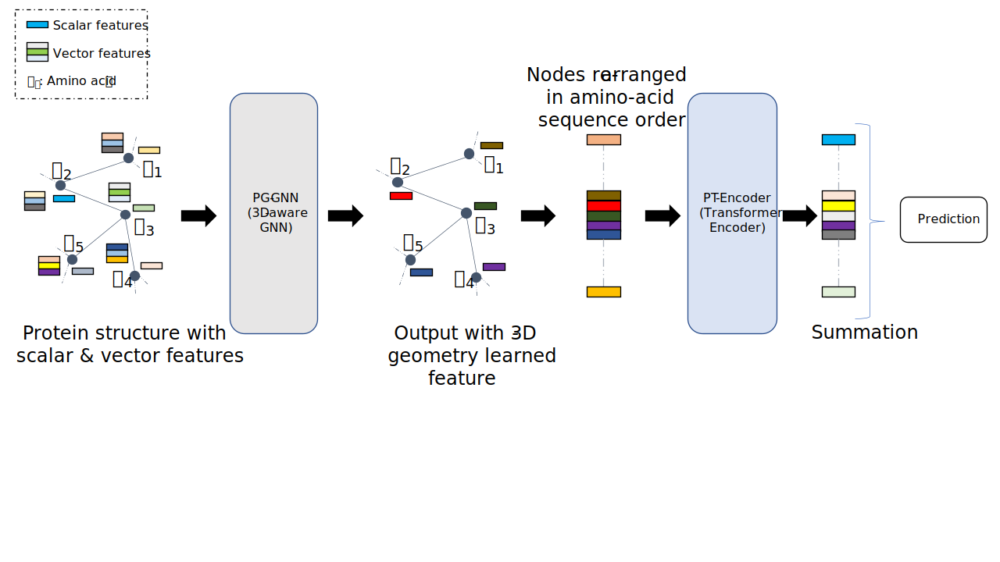

# Protein Function Prediction with Primary-Tertiary Hierarchical Learning

Source code of our work [Protein Function Prediction with Primary-Tertiary Hierarchical Learning]().

  


## Implementation Setup
* Python==3.7
* [PaddlePaddle](https://www.paddlepaddle.org.cn/documentation/docs/en/install/index_en.html)==2.2.1
* [Pgl](https://pgl.readthedocs.io/en/stable/quick_start/instruction.html)==2.2.2
* scikit-learn==1.0.1
* tqdm==4.62.3 

## Dataset
The [Protein Data Bank (PDB)](https://www.rcsb.org/). We used the data split sets (i.e., test, validation, training) proposed by [[1]](#1) which can be downloaded from their [repository](https://github.com/flatironinstitute/DeepFRI/tree/master/preprocessing/data).  Our pre-processed data can be found [here](https://bit.ly/3bYb7sx) (they should be copied to the folder [data](./data) after extraction). Alternatively, the raw data can be preprocessed with scripts in [data/preprocessing](./data/preprocessing/) folder.


## Training
```
python train.py [params]   
```
Where <i>params</i> are keyword arguments. See [train.py](./train.py) for the list of arguments (with their default values).   


## References

> <a id="2">[1]</a> 
Gligorijević, V., Renfrew, P.D., Kosciolek, T. et al. [Structure-based protein function prediction using graph convolutional networks](https://doi.org/10.1038/s41467-021-23303-9). Nat Commun 12, 3168 (2021).
