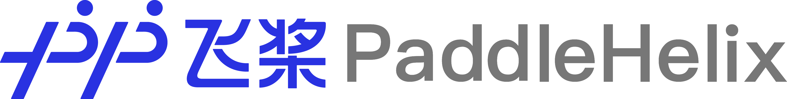
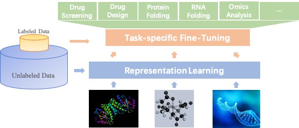

*****************************
Welcome to PaddleHelix Helper
*****************************

.. image:: https://travis-ci.org/readthedocs/sphinx_rtd_theme.svg?branch=master
   :target: https://github.com/PaddlePaddle/PaddleHelix/releases
   :alt: Release Version
.. image:: https://img.shields.io/badge/python-3.6+-orange.svg
   :alt: Python Version
.. image:: https://img.shields.io/badge/os-linux%2C%20win%2C%20mac-yellow.svg
   :alt: OS
.. image:: https://readthedocs.org/projects/sphinx-rtd-theme/badge/?version=latest
   :target: https://paddlehelix.readthedocs.io/en/dev/
   :alt: Documentation Status

Features
========

- High Efficiency: We provide LinearRNA, a highly efficient toolkit for RNA structure prediction and analysis. LinearFold & LinearPartition achieve O(n) complexity in RNA-folding prediction, which is hundreds of times faster than traditional folding techniques.

.. image:: ../.github/LinearRNA.jpg
   :align: center

- Large-scale Representation Learning: Self-supervised learning for molecule representations offers prospects of a breakthrough in tasks with limited annotation, including drug profiling, drug-target interaction, protein-protein interaction, RNA-RNA interaction, protein folding, RNA folding, and molecule design. PaddleHelix implements various representation learning algorithms and state-of-the-art large-scale pre-trained models to help developers start from "the shoulders of giants" quickly.

- Rich examples and applications: PaddleHelix provides frequently used components such as networks, datasets, and pre-trained models. Users can easily use those components to build up their models and systems. PaddleHelix also provides multiple applications, such as compound property prediction, drug-target interaction, and so on.

Installation
============

OS support
----------

Windows, Linux and OSX

Python version
--------------

Python **3.6, 3.7**

Dependencies
-------------------

- PaddlePaddle **>= 2.0.0rc0**
- pgl **>= 2.1**

Quick Start
-------------

- PaddleHelix can be installed directly with ``pip``:

.. code:: console

   $ pip install paddlehelix

- or install from source:

.. code:: console

   $ pip install --upgrade git+https://github.com/PaddlePaddle/PaddleHelix.git

.. note:: Please check our :doc:`/installation` part for full installation prerequisites and guide.

Tutorials
=========

- We provide abundant :doc:`/tutorials` to help you navigate the repository and start quickly.

- PaddleHelix is based on `PaddlePaddle`_, a high-performance Parallelized Deep Learning Platform.

.. _PaddlePaddle: https://github.com/paddlepaddle/paddle

Examples
========

- `Compound Representation Learning and Property Prediction <https://github.com/PaddlePaddle/PaddleHelix/tree/dev/apps/pretrained_compound>`_

- `Protein Representation Learning and Property Prediction <https://github.com/PaddlePaddle/PaddleHelix/tree/dev/apps/pretrained_protein>`_

- `Drug Target Interaction <https://github.com/PaddlePaddle/PaddleHelix/tree/dev/apps/drug_target_interaction>`_

- `Molecular Generation <https://github.com/PaddlePaddle/PaddleHelix/tree/dev/apps/molecular_generation>`_

- `Drug Drug Synergy <https://github.com/PaddlePaddle/PaddleHelix/tree/dev/apps/drug_drug_synergy>`_

- `LinearRNA <https://github.com/PaddlePaddle/PaddleHelix/tree/dev/c/pahelix/toolkit/linear_rna>`_

Guide for developers
====================

- If you need help in modifying the source code of **PaddleHelix**, please see our :doc:`/developer`.

Contribution
============

If you would like to develop and maintain PaddleHelix with us, please refer to our `GitHub repo`_.

.. _GitHub repo: https://github.com/PaddlePaddle/PaddleHelix

