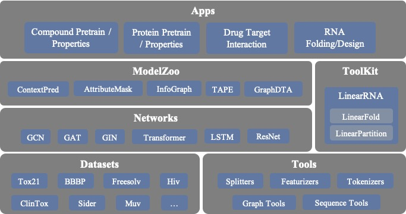

# 背景

机器学习，特别是深度学习正在制药工业和生物信息学中发挥着越来越重要的作用。例如，基于深度学习的方法可以用于预测[药物-靶点相互作用](https://www.researchgate.net/publication/334088358_-GraphDTA_-drug-target_-binding_-affinity_使用_-graph-convolative_-networks)和[分子性质](https://pubmed.ncbi.nlm.nih.gov/30165565/)，从而以相当低的计算成本达到可接受的预测精度，而这些数据以前只能通过体内/体外实验或计算复杂度极高的仿真方法（如分子动力学模拟等）来获得。另一个例子是借助深层神经网络，我们可以更好地解决 *in silico* [RNA折叠](https://www.researchgate.net/publication/344954534_LinearFold_Linear-Time_预测_RNA_次级结构)和[蛋白质折叠](https://www.researchgate.net/publication/338619491_改进的_蛋白质结构_预测_使用来自_deep_学习的潜力)这两个问题。机器学习和深度学习的应用可以大大提高问题求解的效率，从而降低药物发现、疫苗设计等工业应用的成本。深度学习模型具有强大的学习能力，而将其应用于制药行业的一个关键挑战在于如何解决模型对大量训练数据的需求与有限的标注数据之间的矛盾。近年来，自监督学习在自然语言处理和计算机视觉领域取得了巨大的成功，表明模型可以从大量的未标注数据和通用任务中学习到有益的信息。在分子表示的问题上，也有类似的情况。我们有大量未标记的数据，包括蛋白质序列（超过1亿条）和化合物信息（超过5000万条）等，但其中有标注的数据较少。

**PaddleHelix** 是一个高性能并且专为生物计算任务开发的机器学习框架。它的特色在于大规模的表示学习（representation learning）和易用的API，我们期望为制药和生物领域的研究人员和工程师提供最新和最先进的AI工具。

# PaddleHelix 导览

# Tutorials
* [药物-靶点相互作用预测](drug_target_interaction_tutorial.ipynb)
* [化合物表示学习和性质预测](compound_property_prediction_tutorial.ipynb)
* [蛋白质表示学习和性质预测](protein_pretrain_and_property_prediction_tutorial.ipynb)
* [RNA二级结构预测](linearrna_tutorial.ipynb)
